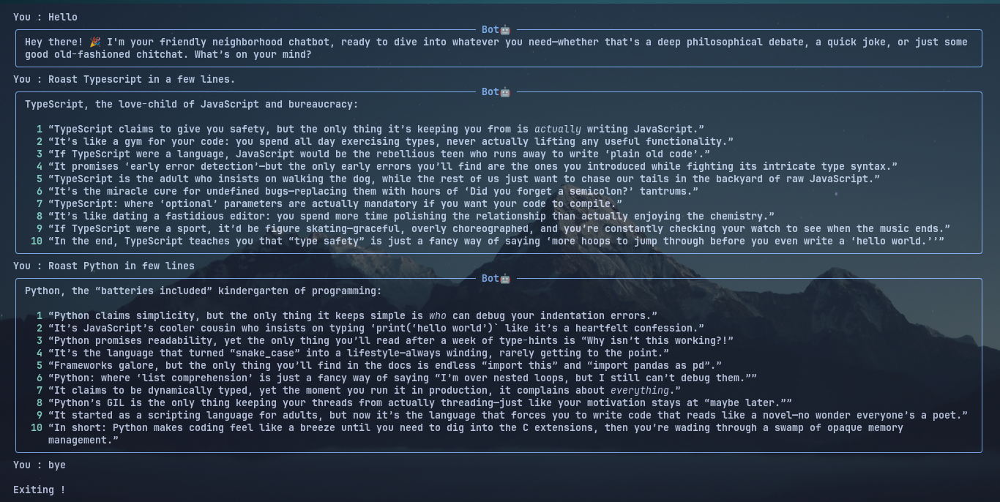

# Terment

A simple terminal chatbot built with Python, OpenAI-compatible API, Rich, and uv. Uses Catppuccin mocha theme.

## Features

- Streaming responses
- Rich terminal UI
- OpenAI-compatible providers
- Conversation memory

## How to use
- Run uv venv then uv sync
- Rename .env.example to .env
- Add your orginal api key to .env
- Run the main file using uv run main.py
...

## Screenshot

